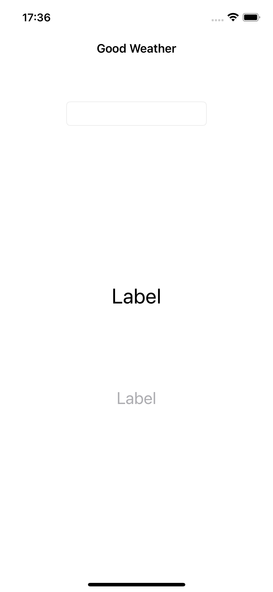
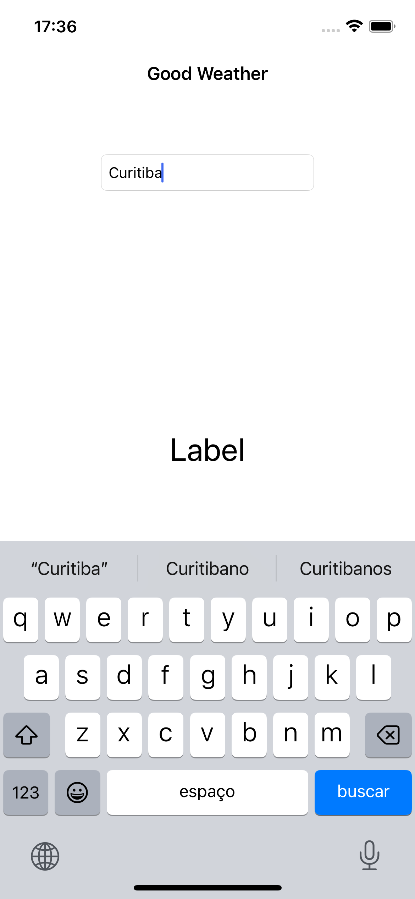
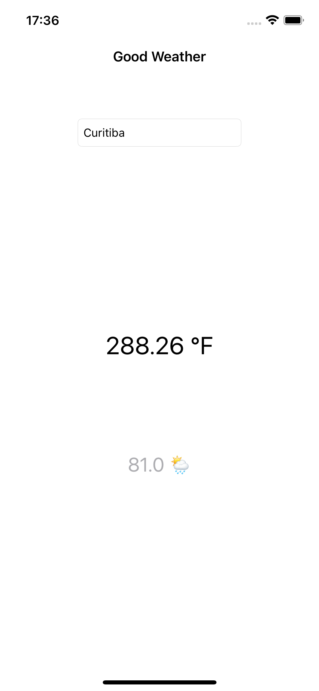

# GoodWeather-RxSwift
 
* Recursos estudados
    * Observables
        * Observables
        * Subscriptions
        * Diposing and Terminating

    * Transforming operators
        * Map
 
    * RxCocoa
        * Driver
        * Control Property

## Snapshots

  
 

  
 

  
 